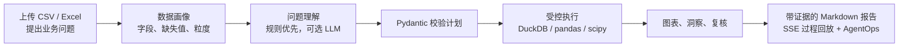

# LangGraph Data Analyst Agent Workbench

[](https://github.com/Lz123-ai/langgraph-data-analyst-agent-workbench/actions/workflows/ci.yml)
[](LICENSE)

一个本地优先、可追溯的数据分析 Agent。它把 CSV/Excel 文件转化为经过数据画像、分析规划、受控执行、结果复核和证据化报告的完整工作流，而不是把自然语言直接交给任意 Python 或 SQL 执行。

> 适合展示 LangGraph Agent 编排、可靠性工程、数据分析工具调用、可观测性和评测体系。默认是单机可信用户模式；共享部署支持 Token 或 OIDC/JWT 身份隔离。

## 为什么不是普通聊天机器人



- **Grounded**：所有结论来自 DuckDB 或 pandas/scipy 的真实计算结果。
- **Safe by design**：不执行模型生成的任意 Python、Shell 或写操作 SQL。
- **Know when to stop**：预测、因果推断、无关领域或缺字段的问题会明确返回不支持，而不是编造答案。
- **Observable**：任务、SSE 事件、节点 Trace、Token、载荷大小和评测结果均可追溯。
- **Recoverable**：中断任务重启后会自动重新执行；失败或取消任务可以用原 Task ID 重试。

## 核心能力

| 模块 | 已实现能力 |
| --- | --- |
| 数据接入 | CSV/Excel 上传、大小/行列限制、路径边界、数据画像、预览与删除 |
| Agent 工作流 | `load → profile → understand → plan → execute → chart → insight → review → report` |
| 分析引擎 | DuckDB 聚合、pandas/scipy 相关性/异常值/分布、MRR、续费风险、Pipeline 等业务模板 |
| 可信输出 | Pydantic 计划校验、字段白名单、单条只读 SQL、证据表、风险提示和报告复核 |
| 运行时 | SQLite 任务/事件持久化、SSE 断线重放、多订阅者、取消、超时、并发限制、重试 |
| 安全与权限 | 本地模式、共享 Token、OIDC/JWT、tenant/user 资源隔离、限流、安全响应头、请求 ID |
| AgentOps | Trace、真实 Provider Token 用量、规则节点载荷、成本估算、Prometheus 格式指标 |
| 质量保证 | pytest、Ruff、覆盖率门槛、公开回归评测、Playwright E2E、Docker Compose 构建 |

## 技术栈

- **Agent**：LangGraph、LangChain Core、Pydantic
- **Backend**：FastAPI、SQLite、DuckDB、pandas、scipy、SSE
- **Frontend**：Vue 3、TypeScript、Vite、ECharts
- **质量与交付**：pytest、coverage、Ruff、Vitest、Playwright、Docker Compose、GitHub Actions、Dependabot
- **模型适配**：OpenAI、OpenAI-compatible API（DeepSeek / Qwen / Moonshot / 智谱等）、Ollama

## 5 分钟体验

### Windows 一键启动

```powershell
git clone https://github.com/Lz123-ai/langgraph-data-analyst-agent-workbench.git
cd langgraph-data-analyst-agent-workbench
powershell -ExecutionPolicy Bypass -File .\scripts\start-dev.ps1 -Install
```

打开：

- 前端：http://127.0.0.1:5173/
- 后端健康检查：http://127.0.0.1:8000/api/health

停止服务：

```powershell
.\scripts\stop-dev.ps1
```

### Docker Compose

```powershell
docker compose up --build
```

打开 http://127.0.0.1:8080/ 。Windows 首次安装 Docker/WSL 可运行：

```powershell
.\scripts\install-docker-prerequisites.ps1
.\scripts\verify-docker.ps1
```

### 手动开发

```powershell
python -m venv .venv
.\.venv\Scripts\python.exe -m pip install -r requirements.txt

cd backend
..\.venv\Scripts\python.exe -m uvicorn app.main:app --reload --host 127.0.0.1 --port 8000
```

新开终端：

```powershell
cd frontend
npm install
npm run dev
```

## 推荐演示流程

1. 上传 `samples/sales_sample.csv`。
2. 提问：`按 region 统计 sales 最高的地区，并生成图表和报告`。
3. 查看 SSE 时间线，观察每个 LangGraph 节点完成。
4. 查看 ECharts 图表、结果表、分析方法与 Markdown 报告。
5. 打开 **AgentOps**，查看任务 Trace、Token、成本和评测记录。
6. 再尝试：
   - `分析 sales 和 profit 的相关性`
   - `分析 sales 的分布`
   - `检测 profit 的异常值`
   - `预测下个月销售额`（应被明确拒绝，而不是伪造预测）

## 可选：接入 LLM

默认 `USE_LLM=false`，项目仍可通过规则模式完整运行和测试。启用模型后，LLM 只用于结构化问题理解；分析执行仍由固定工具和真实数据约束。

复制 `.env.example` 为本地忽略的 `.env`，例如接入 DeepSeek：

```env
USE_LLM=true
LLM_PROVIDER=openai_compatible
LLM_MODEL=deepseek-chat
LLM_API_KEY=replace-with-your-new-key
LLM_BASE_URL=https://api.deepseek.com/v1
```

启动后执行显式的低成本连通性验证：

```powershell
.\scripts\verify-llm.ps1
```

不要把 Key 写入 README、Issue、Commit、终端截图或聊天记录；泄露后应立即撤销。更多配置见 [模型 Provider 文档](docs/model_providers.md) 和 [LLM 验证说明](docs/llm_verification.md)。

## 质量门禁

公开仓库当前基线：

- 后端：49 个 pytest 用例，79% 源代码覆盖率
- 公开 Agent 回归评测：18/18
- 前端：Vitest、生产构建、Playwright 上传到报告 E2E
- 容器：Docker Compose 配置、双镜像构建、后端健康检查与前端冒烟

```powershell
.\.venv\Scripts\python.exe -m pytest -q
.\.venv\Scripts\python.exe -m ruff check backend\app agent_eval
.\.venv\Scripts\python.exe agent_eval\run_batch_eval.py

cd frontend
npm test
npm run build
npm run test:e2e
```

企业业务评测使用单独分发的数据集，不会放进公开仓库。获取数据后运行：

```powershell
.\.venv\Scripts\python.exe agent_eval\enterprise_business_eval.py --data-dir <dataset-directory>
```

公开 CI 会在该数据不存在时明确跳过企业评测，而不会把跳过伪装为通过。详见 [评测策略](docs/evaluation.md)。

## 部署与安全边界

| 场景 | 建议配置 |
| --- | --- |
| 本地演示 | `APP_ENV=development`、`AUTH_MODE=local` |
| 共享测试 | `AUTH_MODE=token`、HTTPS 反向代理、显式 CORS/Host、限流 |
| 多用户部署 | `APP_ENV=production`、`AUTH_MODE=oidc`、OIDC issuer/audience/JWKS |

生产模式会拒绝本地鉴权、通配符 CORS、缺少 Token 或不完整 OIDC 配置。运行时提供：

- `GET /api/ops/model-status`：不暴露密钥的模型配置状态。
- `POST /api/ops/model-smoke-test`：显式模型连通性验证。
- `GET /api/ops/metrics`：需鉴权的 Prometheus 格式指标。
- `POST /api/analysis/tasks/{task_id}/retry`：失败或取消任务的原 ID 重试。

当前 SQLite + 单进程限流适合本地和单实例部署。多副本生产环境仍需要 PostgreSQL、对象存储、共享队列/限流与 LangGraph checkpoint；详细边界见 [生产就绪说明](docs/production_readiness.md)。

## 项目文档

- [架构与扩展点](docs/architecture.md)
- [认证与 OIDC](docs/authentication.md)
- [评测策略](docs/evaluation.md)
- [模型 Provider](docs/model_providers.md)
- [LLM 在线验证](docs/llm_verification.md)
- [威胁模型](docs/threat_model.md)
- [本地配置](docs/local_setup.md)
- [贡献指南](CONTRIBUTING.md)
- [安全政策](SECURITY.md)
- [变更记录](CHANGELOG.md)
- [交给其他 AI 测试](AGENT_HANDOFF.md)

## 参与贡献

欢迎提交 Issue 和 PR。真实失败案例应先加入 pytest 或 `agent_eval/cases.json`，再修复实现，确保问题不会回归。请勿提交密钥、用户数据、SQLite 文件、日志或企业评测原始数据。

本项目采用 [MIT License](LICENSE)。
